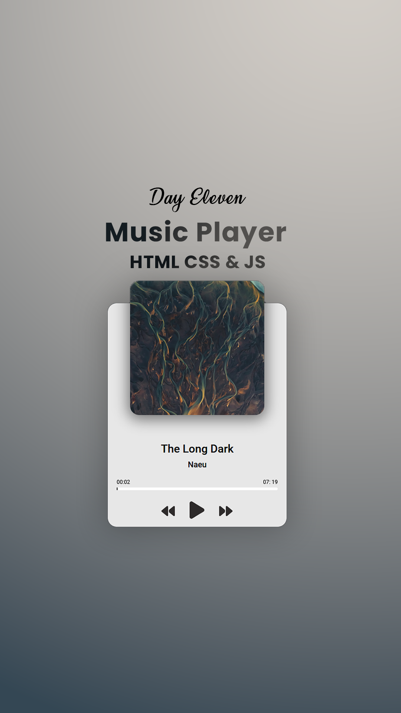

# Day #11

### Music Player App
In this tutorial ([Open in Youtube](https://youtu.be/5y_P2ZGLarE?si=eGz3q-K8hRD9yYIk)),  I am gonna showing to you how to code a music player in javascript. we create a project that you can play audio files with javascript from local folder or any url❗️

# Screenshot
Here we have project screenshot :

