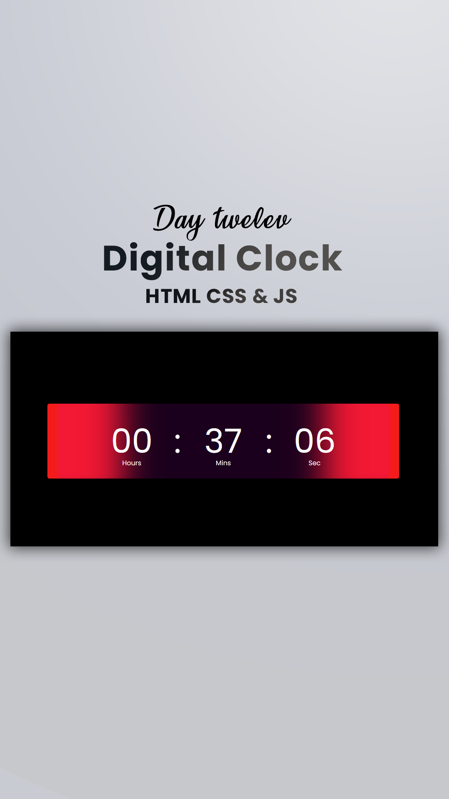

# Day #12

### Digital Clock
In this tutorial ([Open in Youtube](https://youtu.be/aWmBYkWYaSs)),  I am gonna showing to you how to code a digital Clock with javascript. with this javascript digital clock you can see the correct Time and use it in your site design projects❗️

# Screenshot
Here we have project screenshot :

