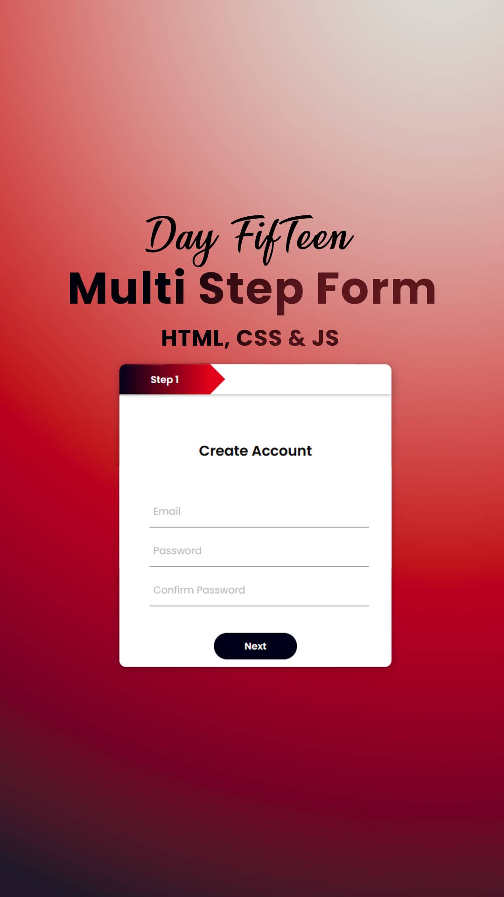

# Day #8

### Multi Step Form
In this tutorial ([Open in Youtube](https://youtu.be/byAC5fQhTrE)),  I am gonna showing to you how to code a simple multiStep form with javascript. you can use this form in your site to get user data❗️
this form also is responsive!

# Screenshot
Here we have project screenshot :

