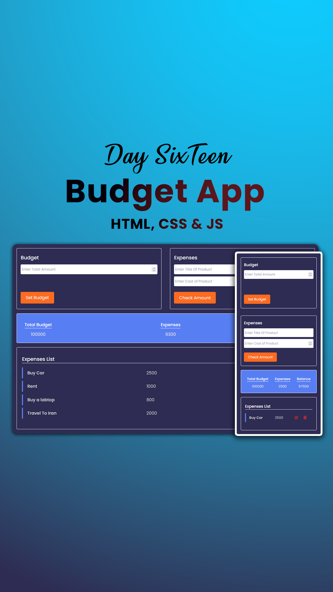

# Day #16

### Budget App
In this tutorial ([Open in Youtube](https://youtu.be/_gQEt5aJI2c?si=pMXZ7eY0muM12Oyh)),  I am gonna showing to you how to code a budget app with javascript. this budget app is fully responsive and you can use it in your web projects❗️

# Screenshot
Here we have project screenshot :

