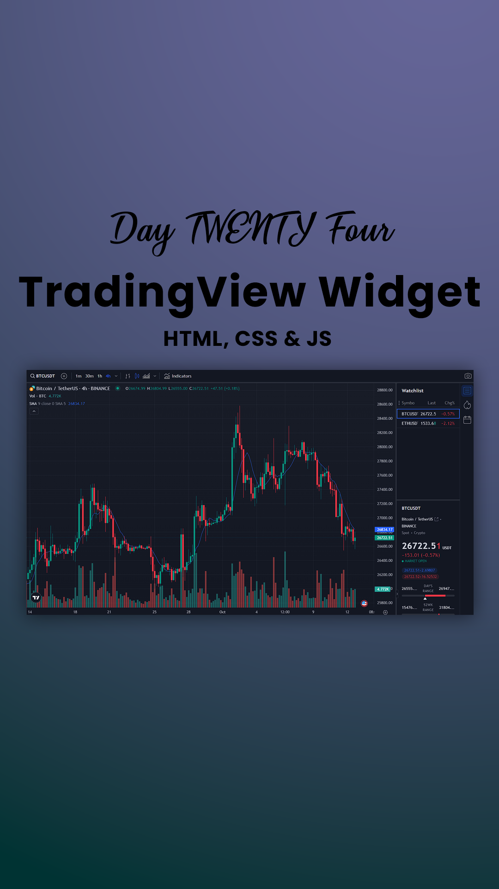

# Day #24

### TradingView Widget
In this tutorial ([Open in Youtube](https://youtu.be/-tRAtbfTQDs)), I am gonna showing to you how to use tradingview widget api in javascript. Also this code is fully responsive and we show you 2 method of coding for it❗️

# Screenshot
Here we have project screenshot :

