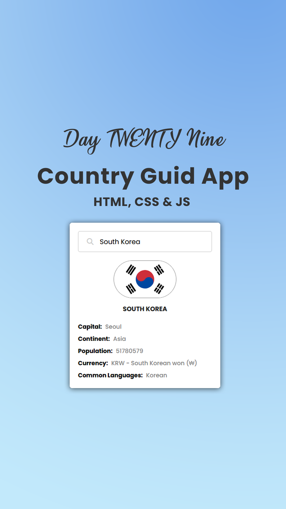

# Day #29

### Country Guide Api
In this tutorial ([Open in Youtube](https://youtu.be/eBoPO40yPTQ)),  I am gonna showing to you how to use Country api in javascript. we create a project that you can search country names and see their details with javascript❗️

# Screenshot
Here we have project screenshot :

