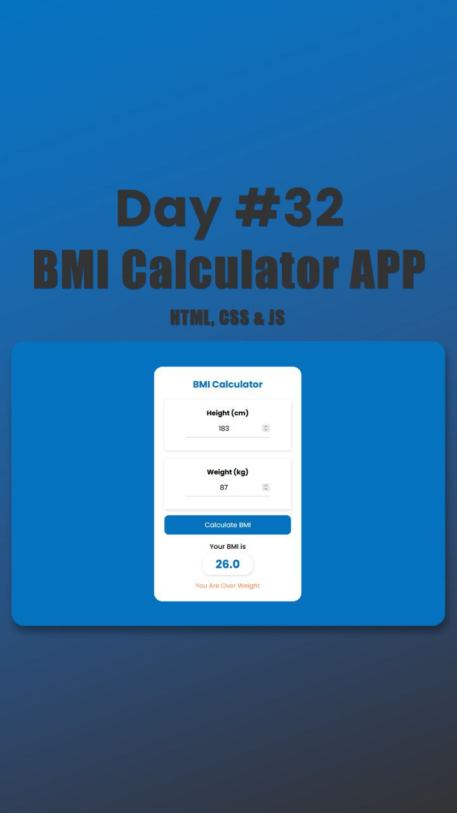

# Day #32

### BMI Calculator App
In this tutorial ([Open in Youtube](https://youtu.be/1JMGkcsrDsE)), This code creates a BMI (Body Mass Index) calculator using HTML CSS and JavaScript. It takes user input for height and weight, calculates the BMI, and displays the result along with a health status message. 

# Screenshot
Here we have project screenshot :

