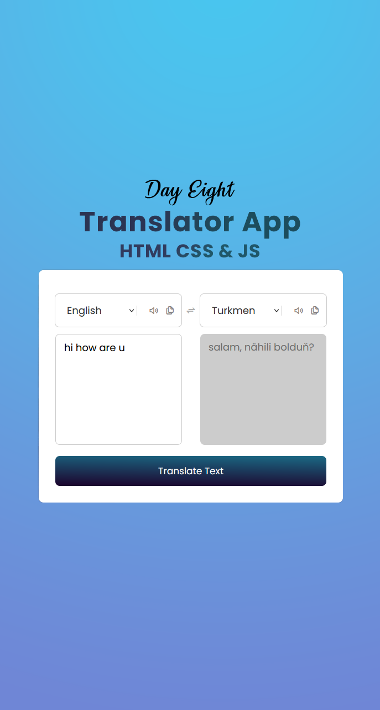

# Day #08

### Translator App
In this tutorial ([Open in Youtube](https://youtu.be/bphltwf_Wpk)),  I am gonna showing to you how to code a translator app with javascript. in this tutorial also we use a translate api and we get data from api and this code is also responsive❗️
in this video we have a google translate clone 😁

# Screenshot
Here we have project screenshot :

